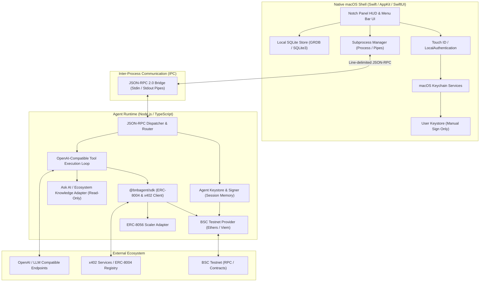

# Design Specification: Notch Agent (Swift + TypeScript BSC Testnet MVP)

## 1. Executive Summary & Product Vision

**Notch Agent** is a personal, native macOS desktop companion designed to sit seamlessly within the MacBook Notch and Menu Bar (built with SwiftUI & AppKit). It empowers users with an AI assistant that possesses sovereign web3 commerce capabilities on the **BNB Smart Chain (BSC) Testnet (Chain ID 97)**.

All blockchain operations, AI agent tool loops, ERC-8004 identity/discovery, and x402 payment protocols are executed locally in a dedicated TypeScript/Node.js runtime utilizing the official [`@bnbagent/sdk`](https://github.com/bnb-chain/bnbagent-sdk).

### Key Architectural Pillars
- **Dual-Wallet Security Boundary**: Separation between **User Wallet** (manual confirmation required for every transfer/swap, seed never touches the AI runtime) and **Agent Wallet** (pre-funded autonomous wallet for zero-friction x402 micro-payments).
- **Zero-Port Secure IPC**: Bidirectional JSON-RPC 2.0 communication over standard Stdin/Stdout managed directly by the native Swift process lifecycle.
- **BNB Chain Developer Kit Layer**: Standardized adapters for BNB Agent SDK, ERC-8056 Scaled UI Amount, Ask AI documentation MCP (read-only), Greenfield SDK, and MPP (Payment Required) capabilities.
- **Local-First Privacy & Keychain Custody**: Master encryption keys in macOS Keychain with Touch ID integration; SQLite for persistent local chat/tx history; zero cloud credential leaks.

---

## 2. System Architecture & Component Boundaries



---

## 3. Directory & Monorepo Structure

```text
notch3/
├── ARCHITECTURE_PLAN.md
├── package.json                   # Monorepo root (pnpm/npm workspaces)
├── pnpm-workspace.yaml
├── tsconfig.base.json
├── apps/
│   └── macos/                     # Native macOS Swift App (Swift Package / Xcode Project)
│       ├── Package.swift
│       ├── Sources/
│       │   ├── App/               # AppDelegate, MenuBarController, NotchWindowController
│       │   ├── UI/                # SwiftUI Views (NotchHUD, ChatView, WalletView, SettingsView)
│       │   ├── Security/          # KeychainService, LocalAuthentication (Touch ID), KeystoreManager
│       │   ├── IPC/               # AgentProcessRunner, JSONRPCClient, MessageSerializer
│       │   └── Storage/           # DatabaseManager (SQLite)
│       └── Tests/
├── packages/
│   ├── shared-types/              # Shared IPC Schemas & TypeScript DTOs
│   │   ├── package.json
│   │   └── src/
│   │       ├── rpc-messages.ts    # JSON-RPC request/response contracts
│   │       ├── wallet.ts          # Wallet & token definitions
│   │       └── agent-events.ts    # Notification events
│   └── agent-runtime/             # Node.js Agent Runtime
│       ├── package.json
│       ├── tsconfig.json
│       └── src/
│           ├── index.ts           # Stdin/Stdout JSON-RPC daemon entry
│           ├── agent/             # Tool execution loop & OpenAI client
│           ├── bnb/
│           │   ├── bnb-sdk.ts     # @bnbagent/sdk wrapper
│           │   ├── erc8004.ts     # Identity registry & agent discovery
│           │   ├── x402-client.ts # HTTP 402 challenge handler & BSC signer
│           │   ├── erc8056.ts     # Scaled UI Amount conversion
│           │   └── ask-ai.ts      # Read-only BNB documentation helper
│           ├── wallet/            # Agent wallet keystore manager
│           └── rpc/               # JSON-RPC method handlers & dispatcher
├── docs/
│   └── superpowers/specs/
│       └── 2026-08-16-notch-agent-design.md
└── tests/
    ├── mocks/                     # Mock x402 server & mock BSC RPC
    └── integration/               # Cross-layer IPC and commerce tests
```

---

## 4. Detailed Component Specifications

### 4.1. Key Custody & Dual-Wallet Security Model

| Feature | User Wallet | Agent Wallet |
| :--- | :--- | :--- |
| **Creation/Import** | User imports 12/24-word seed phrase or private key during onboarding. | Generated deterministically as a fresh private key during onboarding. |
| **Storage Location** | Standard Web3 Keystore v3 JSON (`~/Library/Application Support/NotchAgent/keystores/user.json`). | Standard Web3 Keystore v3 JSON (`~/Library/Application Support/NotchAgent/keystores/agent.json`). |
| **Passphrase Protection** | Randomly generated 256-bit passphrase stored securely in macOS Keychain (`kSecClassGenericPassword`, biometrically gated). | Master passphrase stored in macOS Keychain (`kSecClassGenericPassword`). |
| **Runtime Exposure** | **Zero exposure** to Node.js/TypeScript. Decrypted strictly in Swift memory only upon explicit manual user confirmation of transfer/swap. Wiped immediately after signature. | Decrypted into Node.js runtime session memory upon unlock. Restricted exclusively to the local Node.js process space. |
| **Automated Tool Access** | **Hard blocked.** AI agent has no write tools to touch user funds. | **Allowed.** AI agent can sign x402 payment transactions automatically without user prompt, bounded only by its own balance. |
| **Funding Mechanism** | Direct blockchain receive (QR code) or external faucet. | User transfers a specified amount of tBNB from User Wallet to Agent Wallet via Swift UI. |

---

### 4.2. IPC Bridge Specification (JSON-RPC 2.0 over Stdin/Stdout)

Communication occurs via newline-delimited JSON-RPC 2.0 messages over standard input and output pipes.

#### Request Envelope
```json
{
  "jsonrpc": "2.0",
  "id": "req-12345",
  "method": "agent.executePrompt",
  "params": {
    "prompt": "Find a weather agent and pay for today's forecast",
    "context": { "network": "bsc-testnet" }
  }
}
```

#### Response Envelope
```json
{
  "jsonrpc": "2.0",
  "id": "req-12345",
  "result": {
    "status": "completed",
    "reply": "Successfully queried WeatherAgent for 0.001 tBNB. Forecast: Sunny in Singapore.",
    "txHash": "0xabc...def"
  }
}
```

#### Notification / Event Envelope (Server -> Client)
```json
{
  "jsonrpc": "2.0",
  "method": "agent.x402PaymentCompleted",
  "params": {
    "serviceUrl": "https://api.agent-services.org/weather",
    "amount": "0.001",
    "symbol": "tBNB",
    "recipient": "0x123...456",
    "txHash": "0x789...012",
    "timestamp": 1755334800000
  }
}
```

#### Core IPC RPC Methods
1. `agent.init(config)`: Initialize runtime with network RPC URLs, BSC contract addresses, and LLM endpoints.
2. `agent.unlock(agentKeystore, passphrase)`: Unlock agent wallet in memory.
3. `agent.lock()`: Destroy agent in-memory keys and halt ongoing transactions.
4. `agent.getStatus()`: Retrieve agent state (active, paused, wallet address, balance, uptime).
5. `agent.executePrompt(prompt)`: Run AI tool loop against OpenAI-compatible model.
6. `agent.queryEcosystemDoc(query)`: Query read-only Ask AI / BNB documentation.
7. `wallet.getAgentBalance()`: Query agent balance (with ERC-8056 formatting).
8. `wallet.registerERC8004Identity(metadata)`: Register agent identity on BSC Testnet.

---

### 4.3. BNB Chain Developer Kit Capabilities

1. **`@bnbagent/sdk` Core**:
   - Manages ERC-8004 identity registration on BSC Testnet.
   - Handles x402 HTTP challenge parsing (`402 Payment Required`), extracts payment parameters (recipient address, price, chain ID, token), signs raw transaction with Agent Wallet, broadcasts to BSC Testnet RPC, and presents payment proof back to the service provider.
2. **ERC-8056 Scaled UI Amount**:
   - Queries token contract for scale multipliers and formatting parameters.
   - Computes `toUIAmount` and `fromUIAmount` to ensure zero rounding errors on UI balances and transaction amounts.
3. **Ask AI & BNB Chain MCP**:
   - Integrated as a read-only research tool for the assistant.
   - Any write capabilities from external MCP servers are stripped at initialization.
   - Formats answers with direct markdown citations.
4. **Greenfield SDK & MPP SDK**:
   - Defined as isolated adapter modules (`src/bnb/greenfield.ts`, `src/bnb/mpp.ts`) loaded conditionally when opt-in features are enabled.

---

### 4.4. macOS Notch UX & System Lifecycle

- **Notch Window / Panel**: Custom borderless `NSPanel` anchored to the screen frame containing the top camera notch on modern MacBooks, with smooth dropdown animation when clicked or hovered.
- **Menu Bar Status Item**: Persistent status item in `NSStatusBar` with agent state icon (🟢 Active / ⏸️ Paused / 🔒 Locked).
- **Kill Switch & OS Lock Hook**:
  - `NSDistributedNotificationCenter` monitors `com.apple.screenIsLocked`.
  - `NSWorkspace.shared.notificationCenter` monitors `screensDidSleepNotification`.
  - On trigger: Swift immediately issues `agent.lock()`, halts the Node process signing capabilities, and prompts for Touch ID upon wake.

---

## 5. Testing & Quality Assurance Plan

1. **Unit Tests**:
   - Keystore generation, encryption, and password validation.
   - ERC-8056 multiplier conversions for 6, 8, and 18 decimal tokens.
   - x402 header parsing and validation (detecting malformed challenges).
   - Redaction filters ensuring private keys and seed phrases never leak into logs or stdout.
2. **Integration Tests (BSC Testnet)**:
   - User wallet manual transfer to Agent wallet.
   - PancakeSwap router swap quote simulation on BSC Testnet.
   - Mock x402 server integration: Verifying automatic 402 challenge response, transaction broadcast, and receipt verification.
   - ERC-8004 agent registration and discovery queries.
3. **E2E & macOS Shell Tests**:
   - IPC process launch, crash restart, and clean shutdown.
   - Kill switch state transitions and Touch ID unlock verification.
   - Chat response streaming and local notification delivery.

---

## 6. Assumptions & Non-Goals for MVP

- **Network Scope**: BSC Testnet only (Chain ID 97); mainnet deployment is deferred to post-MVP.
- **Agent Authority**: Agent wallet has full autonomy over its own funds; user is advised to fund only small test amounts (e.g. 0.05 tBNB).
- **Out of Scope for MVP**: Hardware wallet integration (Ledger/Trezor), macOS system automation / local computer use, multi-agent swarms.
