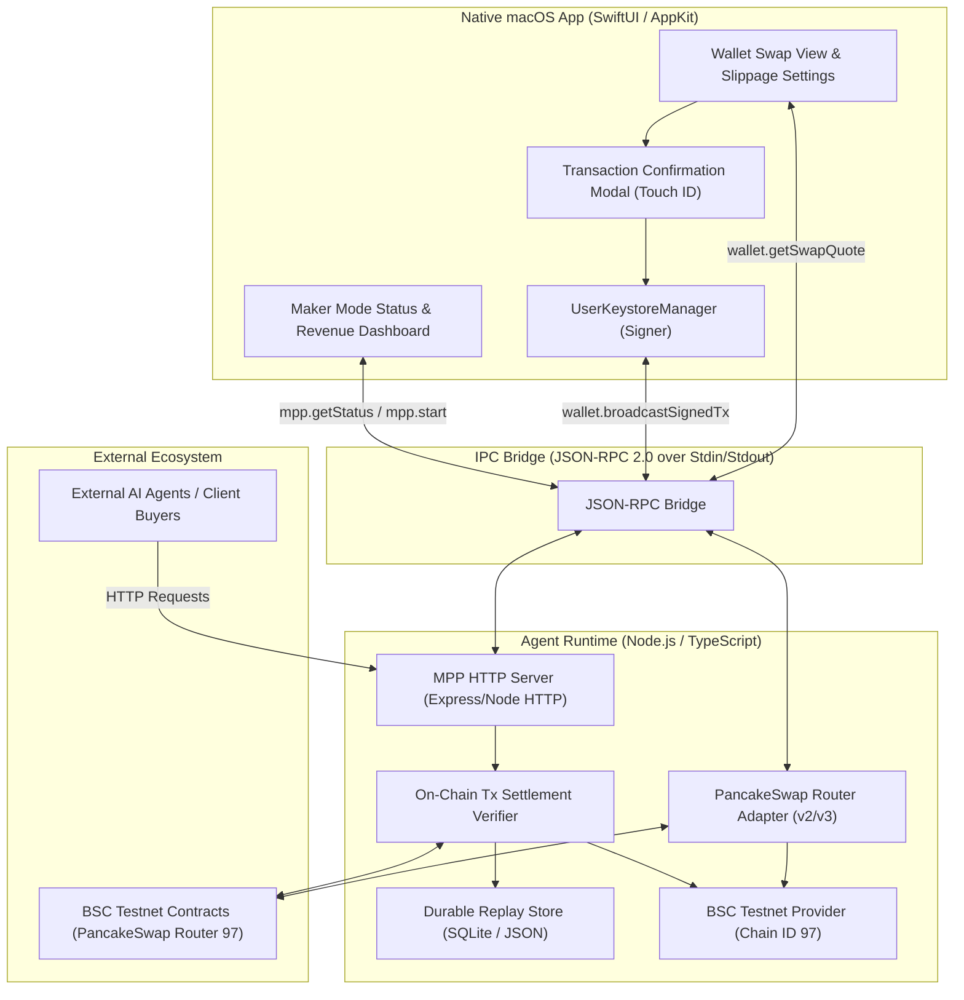

# Design Specification: Notch Agent Phase 2 (PancakeSwap Router & Agent Maker Mode MPP)

## 1. Overview & Objective

Phase 2 expands **Notch Agent** beyond being an autonomous buyer into a dual-capability platform:
1. **PancakeSwap Swap Router Adapter**: Enables users to query live on-chain swap quotes (e.g. `tBNB <-> BUSD / USDT / CAKE` on BSC Testnet 97), inspect price impact and minimum received after slippage, and securely sign the swap using the native Swift **User Wallet** via Touch ID.
2. **Agent Maker Mode (MPP SDK / HTTP 402 Server)**: Empowers Notch Agent to monetize its own local tools by hosting a local/public HTTP server that issues `402 Payment Required` challenges, verifies incoming on-chain transactions on BSC Testnet, and protects against double-spend replay attacks using a durable replay store.

---

## 2. Architecture & Trust Boundaries



---

## 3. Subsystem 1: PancakeSwap Swap Router Adapter

### 3.1. Contract Addresses & Configuration (BSC Testnet 97)
- **PancakeSwap Router v2 (Testnet)**: `0xD99D1c33F9fC3444f8101754aBC46c52416550D1`
- **PancakeSwap Factory v2 (Testnet)**: `0x6725F303b657a9451d8BA641348b6761A6CC7a17`
- **WBNB (Testnet)**: `0xae13d989daC2f0dEbFf460aC112a837C89BAa7cd`
- **Common Testnet Tokens**:
  - `BUSD`: `0xaB1a4d4f1D656d2450692D2377d6832903890260`
  - `USDT`: `0x337610d27c682E347C9cD60743770f1ceCA83547`
  - `CAKE`: `0xFa60D973F7642B748046464e165A65B7323b0C03`

### 3.2. Technical Specifications & Methods
1. `estimateSwapQuote(params: SwapQuoteParams): Promise<SwapQuoteResult>`
   - Queries `getAmountsOut` on the PancakeSwap Router contract.
   - Applies slippage tolerance (default `0.5%`, customizable up to `5%`).
   - Calculates minimum output amount (`amountOutMin`).
   - Returns formatted values with token decimal scaling (`ERC-8056` compatible).
2. `buildSwapTransaction(params: BuildSwapParams): Promise<UnsignedTransactionPayload>`
   - Constructs calldata for `swapExactETHForTokens`, `swapExactTokensForETH`, or `swapExactTokensForTokens`.
   - Returns the target contract, calldata (`0x...`), value (for native BNB input), gas limit, and gas price.
3. **Execution & Security Boundary**:
   - The runtime returns the unsigned transaction parameters to Swift.
   - Swift renders the quote preview, route, and price impact inside `TransactionConfirmationModal`.
   - Upon Touch ID authorization, Swift signs with `UserKeystoreManager.signTransaction` and broadcasts to the BSC provider.
   - The Agent Wallet is **not** used for user swaps; custody remains strictly with the user.

---

## 4. Subsystem 2: Agent Maker Mode (MPP / HTTP 402 Server)

### 4.1. Server Architecture & Workflow
1. **Embedded Local Server**:
   - Lightweight HTTP server listening on configurable host/port (default `127.0.0.1:3402`).
   - Provides public/local endpoints offering services (e.g. `/api/v1/tools/weather`, `/api/v1/tools/analyze`, `/api/v1/tools/summarize`).
2. **Challenge Mechanism (`402 Payment Required`)**:
   - When an unauthenticated request arrives, the server intercepts it and returns HTTP status `402`.
   - Response header:
     ```http
     HTTP/1.1 402 Payment Required
     WWW-Authenticate: x402 token="tBNB", amount="0.001", recipient="<AgentWalletAddress>", chainId="97"
     Content-Type: application/json

     {
       "error": "Payment Required",
       "x402": {
         "token": "tBNB",
         "amount": "0.001",
         "recipient": "0xAgentWalletAddress...",
         "chainId": 97,
         "endpoint": "/api/v1/tools/weather"
       }
     }
     ```
3. **Payment Verification & Replay Protection**:
   - The client agent pays on BSC Testnet and repeats the request with:
     ```http
     Authorization: x402 0xTransactionHash...
     ```
   - The server verifies:
     1. **Replay Check**: Queries the durable `MPPReplayStore` (SQLite / JSON file at `~/Library/Application Support/NotchAgent/mpp-replays.json`). If the `txHash` has already been redeemed, rejects with `403 Forbidden: Transaction already redeemed`.
     2. **On-Chain Confirmation**: Queries BSC Testnet RPC for transaction receipt. Validates `status === 1` (success), `to.toLowerCase() === recipient.toLowerCase()`, `value >= requiredAmount`, and `chainId === 97`.
     3. **Settlement Registration**: Writes `txHash`, payer address, amount, endpoint, and timestamp to `MPPReplayStore`.
     4. **Service Execution**: Executes the tool logic and returns `200 OK` with the deliverable data.

### 4.2. JSON-RPC Management Methods
- `mpp.startServer(port?: number): Promise<{ port: number; status: string }>`
- `mpp.stopServer(): Promise<{ stopped: boolean }>`
- `mpp.getStatus(): Promise<MPPServerStatus>`
- `mpp.getSalesHistory(): Promise<MPPSaleReceipt[]>`

---

## 5. Testing & Quality Assurance Plan

1. **Unit Tests**:
   - PancakeSwap quote math, slippage percentage computations, and calldata encoder verification.
   - MPP challenge header generation and authorization header parsing.
   - `MPPReplayStore` concurrency and double-spend detection.
2. **Integration Tests**:
   - Mock PancakeSwap Router contract verifying `getAmountsOut` simulation.
   - End-to-end Maker Mode loop: Client Agent discovers tool -> Receives 402 -> Pays via Agent Wallet -> Retries with `x402 txHash` -> Server verifies on-chain and delivers payload -> Second retry with same `txHash` is rejected as replayed.
3. **macOS UI Tests**:
   - SwiftUI Swap View quote updates and slippage tolerance selection.
   - Maker Mode revenue tracker and server start/stop toggles in Settings.
