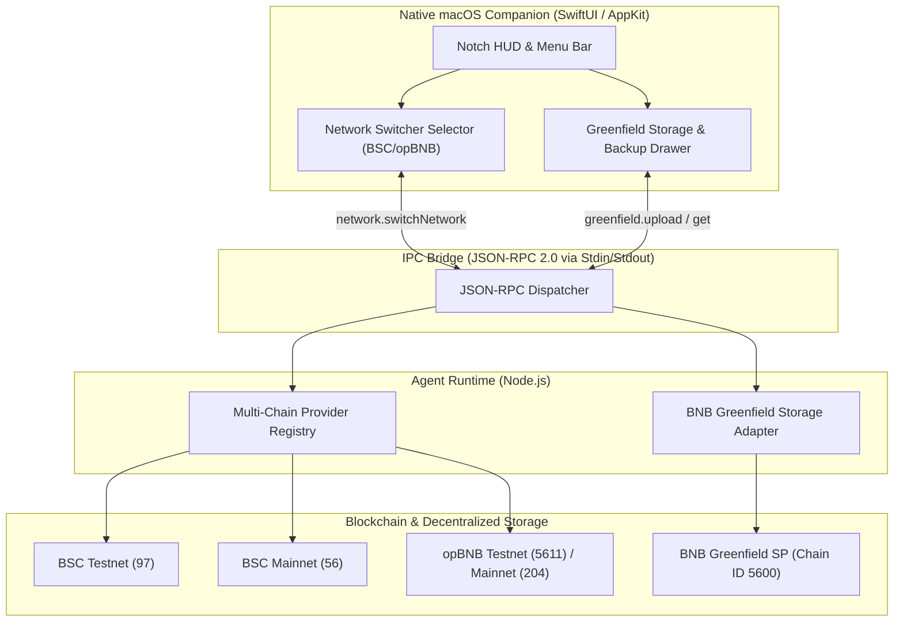

# Design Specification: Notch Agent Phase 3 (Greenfield Storage, Multi-Chain Switcher & macOS App Bundler)

## 1. Overview & Objective

Phase 3 expands **Notch Agent** into a complete production-grade ecosystem:
1. **BNB Greenfield Decentralized Storage Adapter (`@notch/agent-runtime`)**: Off-chain decentralized storage for agent identity metadata, encrypted conversation histories, and agent task deliverables.
2. **Network Switcher (Multi-Chain Support)**: Dynamic runtime and UI switching between **BSC Testnet (97)**, **BSC Mainnet (56)**, **opBNB Testnet (5611)**, and **opBNB Mainnet (204)**.
3. **macOS Standalone Application Packager**: Automated build and bundling pipeline that compiles the Swift native shell in Release mode, bundles the pre-compiled Node.js agent daemon into `Contents/Resources/`, generates proper `Info.plist` with launch agent capabilities, and outputs a standalone `NotchAgent.app`.

---

## 2. Architecture & Subsystems



---

## 3. Subsystem 1: BNB Greenfield Storage Adapter

### 3.1. Technical Specifications
- **Greenfield Testnet Chain ID**: `5600`
- **Default Testnet Storage Provider (SP)**: `https://gnfd-testnet-sp1.bnbchain.org`
- **Default Testnet RPC**: `https://gnfd-testnet-fullnode-tendermint-us.bnbchain.org`
- **Key Capabilities**:
  - `uploadObject(bucket: string, objectName: string, content: string | Buffer, isPrivate?: boolean): Promise<GreenfieldUploadResult>`
  - `getObject(bucket: string, objectName: string): Promise<GreenfieldObjectResult>`
  - `listObjects(bucket: string): Promise<GreenfieldObjectMetadata[]>`
  - `backupChatHistory(sessionId: string, encryptedData: string): Promise<{ objectId: string; url: string }>`

### 3.2. Security & Privacy Boundary
- Private data (e.g. chat transcripts) is symmetrically encrypted with AES-256-GCM before uploading to Greenfield.
- Public metadata (e.g. ERC-8004 agent capability manifests and profile avatars) are stored in public buckets with verifiable content hashes.

---

## 4. Subsystem 2: Network Switcher & Multi-Chain Support

### 4.1. Supported Networks Configuration
| Network Name | Chain ID | Native Token | RPC Endpoint | Explorer |
| :--- | :---: | :---: | :--- | :--- |
| **BSC Testnet** *(Default)* | `97` | `tBNB` | `https://data-seed-prebsc-1-s1.binance.org:8545/` | `https://testnet.bscscan.com` |
| **BSC Mainnet** | `56` | `BNB` | `https://bsc-dataseed.binance.org/` | `https://bscscan.com` |
| **opBNB Testnet** | `5611` | `tBNB` | `https://opbnb-testnet-rpc.bnbchain.org` | `https://testnet.opbnbscan.com` |
| **opBNB Mainnet** | `204` | `BNB` | `https://opbnb-mainnet-rpc.bnbchain.org` | `https://opbnbscan.com` |

### 4.2. JSON-RPC Protocol Methods
- `network.getNetworks(): Promise<NetworkConfig[]>`
- `network.getCurrentNetwork(): Promise<NetworkConfig>`
- `network.switchNetwork(chainId: number): Promise<{ success: boolean; activeNetwork: NetworkConfig }>`

---

## 5. Subsystem 3: Standalone macOS Application Bundler

### 5.1. Bundle Structure (`NotchAgent.app`)
```text
NotchAgent.app/
└── Contents/
    ├── Info.plist               # App metadata, bundle identifier, LSUIElement=YES
    ├── MacOS/
    │   └── NotchAgent           # Compiled Release Swift executable
    ├── Resources/
    │   ├── AppIcon.icns         # High-resolution application icon
    │   ├── agent-runtime/       # Built TypeScript runtime daemon
    │   │   ├── dist/
    │   │   └── package.json
    │   └── node                 # Local Node.js binary wrapper / PATH resolver
    └── PkgInfo
```

### 5.2. Features
- **Menu Bar Accessory Mode (`LSUIElement = true`)**: The app floats natively in the Notch and Menu Bar without cluttering the macOS Dock unless opened.
- **Auto-spawning Embedded Runtime**: Swift checks for bundled `Contents/Resources/agent-runtime/dist/index.js` and launches it over standard pipes automatically.
- **Build Pipeline Script (`scripts/build-macos-app.sh`)**: Single-command automated production build.
